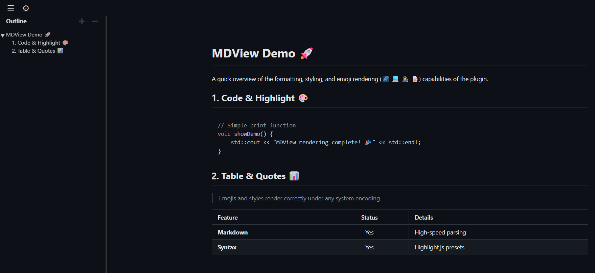

#  MDView

[🌐 Описание на русском](#описание-на-русском)

---

## Description in English

MDView is a Lister (WLX) plugin for Total Commander that allows you to view Markdown files (`.md`, `.markdown`) in a convenient, beautifully formatted way.

### 💻 System Requirements
- **Operating System**: Windows 7 — Windows 11 (64-bit).
- **Dependencies**: Installed [Microsoft Edge WebView2 Runtime](https://developer.microsoft.com/en-us/microsoft-edge/webview2/) component (usually pre-installed on Windows 10 and 11 by default).

### 🎯 Features
- **Rendering:** displaying Markdown according to formatting and layout rules.
- **Syntax highlighting:** accurate highlighting of code blocks (uses Highlight.js).
- **Customization:** support for document and code style themes.
- **Smart Outline:** sidebar outline panel for quick header navigation.
- **Live Reload:** instant updates when the document is modified in an external editor.

#### ⏳ In Development:
- Math formulas support ($LaTeX$ / MathJax) — currently rendered as plain text.
- Complex diagrams rendering (Mermaid / PlantUML) — currently rendered as code blocks.

---

### 📦 Installation

#### 🚀 Automatic Installation (Recommended)
1. Open the downloaded ZIP archive with the plugin inside Total Commander.
2. Confirm the automatic plugin installation prompt.

#### 🛠️ Manual Installation
1. Extract the ZIP archive into a subfolder in your Total Commander plugins folder (e.g., `%Commander_Path%\Plugins\wlx\MDView\`).
2. In Total Commander, go to: **Configuration** -> **Options** -> **Plugins**.
3. Under **Lister Plugins (.WLX)**, click **Configure**.
4. Click **Add** and select the extracted `MDView.wlx64` file.

---

### 🕹️ Usage

- **Viewing:** Highlight any `.md` file and press **F3** (or **Ctrl + Q** for quick view in the adjacent panel).
- **Navigation:** The `☰` button on the top bar toggles the outline panel. Clicking a heading jumps to that section. Use `➕` / `➖` to expand or collapse the header tree.
- **Appearance:** The `⚙` button opens the theme, code style, and language settings.
    > 💡 **Tip:** To cycle through themes quickly, just hover over the dropdown selector and scroll your mouse wheel — the theme will change instantly.

#### 🎨 Custom Themes
You can use any CSS styles compliant with the specifications:
- **For Pages:** Add `.css` style files to the `styles/Main/` folder (standard styles like [GitHub Markdown CSS](https://cdnjs.com/libraries/github-markdown-css) work great).
- **For Code:** Add `.css` style files to the `styles/Code/` folder (fully compatible with themes from the [Highlight.js](https://highlightjs.org/) library). 

---

### ✉️ Feedback & Suggestions
If you found a bug or have a great idea to improve the plugin, feel free to write to: [inbox@alex-regulus.ru](mailto:inbox@alex-regulus.ru)

---

## Описание на русском

[🌐 Description in English](#description-in-english)

MDView — Lister (WLX) плагин для Total Commander, который позволяет просматривать файлы Markdown (`.md`, `.markdown`) в удобном, красиво отформатированном виде.

### 💻 Системные требования
- **Операционная система**: Windows 7 — Windows 11 (64-бит).
- **Зависимости**: Установленный системный компонент [Microsoft Edge WebView2 Runtime](https://developer.microsoft.com/ru-ru/microsoft-edge/webview2/) (в Windows 10 и 11 обычно предустановлен по умолчанию).

### 🎯 Возможности
- **Рендеринг:** отображение Markdown по всем правилам форматирования и верстки.
- **Подсветка синтаксиса:** корректная подсветка блоков кода (используется Highlight.js).
- **Кастомизация:** поддержка тем оформления (стилей) для документа и для подсветки синтаксиса.
- **Умное оглавление:** боковая панель со структурой документа для быстрой навигации по заголовкам.
- **Автообновление (Live Reload):** мгновенное обновление при изменении документа во внешнем редакторе.

#### ⏳ В разработке:
- Поддержка математических формул ($LaTeX$ / MathJax) — сейчас отображается как обычный текст.
- Отрисовка сложных диаграмм и блок-схем (Mermaid / PlantUML) — сейчас отображается как блоки кода.

---

### 📦 Установка

#### 🚀 Автоматическая (рекомендуется)
1. Откройте скачанный ZIP-архив с плагином внутри Total Commander.
2. Подтвердите автоматическое предложение программы об установке плагина.

#### 🛠️ Ручная
1. Распакуйте архив в отдельный каталог в папке плагинов Total Commander (например, `%Commander_Path%\Plugins\wlx\MDView\`).
2. В Total Commander выберите: **Конфигурация** -> **Настройка** -> **Плагины**.
3. В разделе **Плагины просмотра (.WLX)** нажмите **Настройка**.
4. Нажмите **Добавить** и укажите путь к распакованному файлу `MDView.wlx64`.

---

### 🕹️ Использование плагина

- **Просмотр:** Выделите любой `.md` файл и нажмите **F3** (или **Ctrl + Q** для быстрого просмотра в соседней панели).
- **Навигация:** Кнопка `☰` на верхней панели открывает оглавление. Клик по заголовку перенесет вас к нужному разделу. Кнопки `➕` / `➖` разворачивают и сворачивают дерево заголовков.
- **Внешний вид:** Кнопка `⚙` открывает настройки тем, стилей кода и языка.
    > 💡 **Лайфхак:** Чтобы быстро перебирать темы, просто наведите курсор на выпадающий список и покрутите колесико мыши — оформление изменится мгновенно.

#### 🎨 Добавление собственных тем
Вы можете использовать любые совместимые со спецификациями CSS-стили:
- **Для страниц:** Добавьте файлы стилей `.css` в папку `styles/Main/` (подходят любые стандартные стили, например [GitHub Markdown CSS](https://cdnjs.com/libraries/github-markdown-css)).
- **Для кода:** Добавьте файлы стилей `.css` в папку `styles/Code/` (полная совместимость с темами библиотеки [Highlight.js](https://highlightjs.org/)). 

---

### ✉️ Отзывы и пожелания
Если вы нашли баг или у вас есть крутая идея для улучшения плагина, пишите на почту: [inbox@alex-regulus.ru](mailto:inbox@alex-regulus.ru)

---

## ⚖️ License / Лицензия
The plugin is distributed free of charge for personal and non-commercial use only (Freeware for non-commercial use). 

Плагин распространяется бесплатно для личного и некоммерческого использования.

Information regarding usage terms, copyrights, and third-party open-source components (`md4c`, `WebView2 SDK`, `highlight.js`) is located in the `LICENSE` file.

Условия использования, информация об авторских правах и лицензиях сторонних открытых компонентов (`md4c`, `WebView2 SDK`, `highlight.js`) находятся в файле `LICENSE`.
